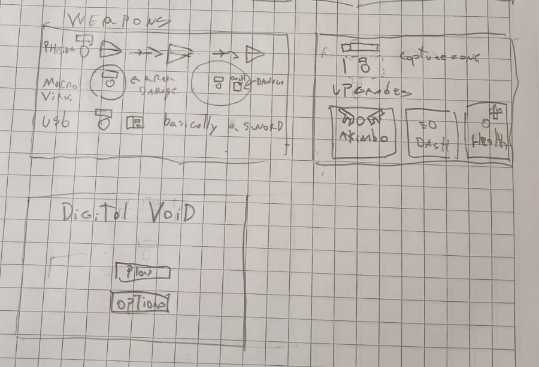

# IDEA DEL JUEGO

## Titulo

Digital Void

<!--#### Mockup
 
 
Make new mockups for the visuals.
-->

## Descripción del juego

Juego 2D estilo top-down shooter roguelike, inspirado en
Alien Shooter,
Vampire Survivors y
Picayune Dreams.

El jugador controla un pequeño bicho malware que se inyecto dentro del sistema de archivos de de una computadora local, con el objetivo de robar informacion de la computadora (edificios), corromperla y sobrevivir ante protocolos de cuarentena que intenten neutralizarla para poder seguir infectando otras computadoras .
Al matar enemigos el malware se vuelve mas fuerte, hasta desbloquear nuevos metodos de ataque de malware como armas.

### Mecanicas

1.- Captura de edificios / zonas que dan potenciadores.  
2.- Subir de nivel da un arma nueva o mejora una actual.
3.- Una barra extra se rellena. Al completarse un jefe aparece.
4.- Jefe inmortal aparece al azar y te persigue por el mapa. La unica opcion es escapar de el.

### Reglas

- Movimiento WASD
- Disparo automatico dirigido por cursor.
- Municion infinita.
- Enemigos derrotados dan experiencia para subir de nivel.

### Flujo de juego (Game Loop)

1) Pantalla de inicio.  
2) Aparece en el mapa y instrucciones aparecen en la pantalla
3) El jugador inicia la partida con un personaje con su arma predeterminada y sin mejoras.
4) Enemigos comienzan a aparecer en oleadas, cada vez más difíciles.  
5) El jugador se mueve y ataca.  
6) Al derrotar enemigos, el jugador gana experiencia y una barra de progreso se llena.  
7) Al subir de nivel, el jugador puede elegir entre varias mejoras para su arma.  
8) El jugador puede explorar el mapa para encontrar edificios que puede capturar para obtener potenciadores.  
9) Al llenar una barra secundaria, un jefe aparece en el mapa.  
10) El jugador debe derrotar al jefe para avanzar a la siguiente etapa, donde las oleadas de enemigos serán más difíciles y el mapa se corrompe aun mas.
11) Al llegar al tercer jefe, que es inmortal, ya habras corrompido todo y tendras que encontrar un "puerto de escape" o una "red adyacente" donde tu malware escapara para poder corromper otra computadora.
12) Al pasar a la siguiente computadora, pierdes toda tu experiencia y armas que se traduce en puntos de mejora, que puedes gastar para mejorar tus capacidades iniciales.
13) Al estar listo, el jugador presiona siguiente inyeccion y el empieza de 0 con las nuevas mejoras.
14) El juego continúa hasta que el jugador muere, se pierde todo, y se muestra la pantalla de fin de juego con la puntuación obtenida. Esta puntuacion, mas la cantidad de computadoras corrompidas, mas de oleadas derrotadas, seran guardadas en un leaderboard con el nombre de usuario.

## Comportamiento de enemigos

1) Spawn en oleadas, cada vez más difíciles.
2) Diferentes tipos de enemigos con habilidades únicas (ejemplo: enemigos que disparan a distancia, enemigos que explotan al morir, enemigos que se mueven rápidamente, etc.).
3) Jefes al final de cada etapa, con patrones de ataque únicos y mayor dificultad.
4) IA simple: siguen al jugador

## Especificaciones técnicas

Framework elegido: Vue + vite para el desarrollo del juego.

Renderizado del juego utilizando HTML5 Canvas para gráficos 2D, flexibilidad en el diseño visual.

### Estructura de carpetas

```
src/  
│  
├── App.vue  
├── main.ts  
│  
├── components/  
│   ├── scenario.vue  
│   ├── GameScene.vue  
│   ├── Instrucciones.vue  
│   ├── mainmenu.vue  
│   ├── PlayerHub.vue  
│   ├── Bosses.vue  
│   ├── Configuración.vue  
│  
├── game/  
│   ├── enemies.ts  
│
├── assets/  
│   ├── sprites/  
│   ├── audio/  
│  
└── stores/  
    ├── game.ts  
    ├── counter.ts  
```

### Dependencias principales

- vue
- vite
- pnpm
- pinia (estado global)
- howler.js (audio)

### Descripcion de armas

- Memoria corrupta (Arma por defecto)
- Ransomware (Arma penetrante)
- Gusano/Worm (Disparo disperso/Escopeta)
- Tormenta de Popups (Arma que orbita alrededor del mouse)
- Virus Troyano (Disparo explosivo) Ps: ningun caballo (troyano o no) fue herido en el proceso de crear esta arma.

## Fase 2

## Mejoras y correcciones

Principalmente, las mejoras que se quieren implementar son correciones visuales y la experiencia de first-time players (explicacion de controles y otras mecanicas).

Otras que valen mencionar serian la falta de un indicador visual del daño causado a enemigos y del jugador.

### Mockup nuevo escenario

- [Redacted]

### Nuevas mecánicas o pantallas de juego

De las correciones visuales, se noto la falta de progreso del mapa, por lo que se preparara implementar diferentes fases del mapa cuando se derrotan cierta cantidad de enemigos.

## Arquitectura fullstack

### Descripcion

La siguiente fase de el diseño sera la implementacion del backend. Su uso siendo orientado para registrar:

- Usuario unico
- Contraseña
- Record/Puntaje Maximo (empieza como 0)
- Computadoras infectadas (empieza como 0, cantidad de reinicios al terminar un escenario, para registrar los loops)
- Preferencias de opciones (si no hay, deja por defecto)

### Estructura

```
backend/  
│  
├── App.js    
│  
├── routes/  
│   ├── 
│    

```

- URL: `/api/dv/users`


### Dependencias fase 2

- express.js
- axios
