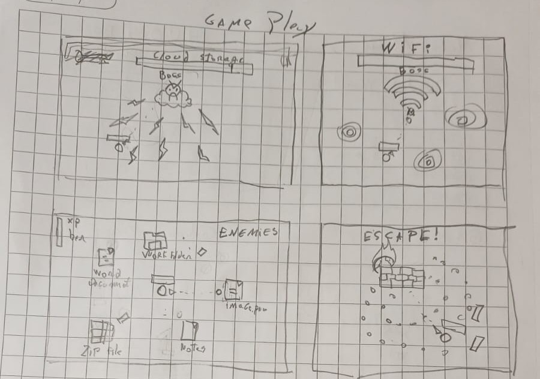

# IDEA DEL JUEGO

Titulo beta: Digital Void 

#### Mockup

## Descripción del juego

Juego 2D estilo top-down shooter roguelike, inspirado en
Alien Shooter,
Vampire Survivors y
Picayune Dreams.

El jugador controla un personaje que debe sobrevivir a oleadas de enemigos en un mapa abierto, mejorando sus armas a medida que avanza. Mientras mas explores, zonas de mejora/edificios empezaran a aparecer, los cuales puedes capturar para obtener un potenciador. (Dash, Double weapons, Friend npc)
Los enemigos botan xp o recursos miscelaneos. (Granadas, Botiquin) 

### Mecanicas
1.- Captura de edificios / zonas que dan potenciadores.  
2.- Subir de nivel da un arma nueva o mejora una actual.
3.- Una barra extra se rellena. Al completarse un jefe aparece.
4.- Jefe inmortal aparece al azar y te persigue por el mapa. La unica opcion es escapar de el.

### Reglas
- Movimiento WASD
- Disparo automatico dirigido por cursor.
- Municion infinita.
- El daño provocado en enemigos es traducido a experiencia.

### Flujo de juego (Game Loop)

1.- Pantalla de inicio.  
2.- El jugador inicia la partida con un personaje con su arma predeterminada y sin mejoras.  
3.- Aparece en el mapa.    
4.- Enemigos comienzan a aparecer en oleadas, cada vez más difíciles.  
5.- El jugador se mueve y ataca.  
6.- Al derrotar enemigos, el jugador gana experiencia y una barra de progreso se llena.  
7.- Al subir de nivel, el jugador puede elegir entre varias mejoras para su arma o habilidades.  
8.- El jugador puede explorar el mapa para encontrar edificios que puede capturar para obtener potenciadores.  
9.- Al llenar una barra secundaria, un jefe aparece en el mapa.  
10.- El jugador debe derrotar al jefe para avanzar a la siguiente etapa, donde las oleadas de enemigos serán más difíciles.  
11.- El juego continúa hasta que el jugador muere, momento en el cual se muestra la pantalla de fin de juego con la puntuación obtenida.  

## Comportamiento de enemigos

1.- Spawn en oleadas, cada vez más difíciles.
2.- Diferentes tipos de enemigos con habilidades únicas (ejemplo: enemigos que disparan a distancia, enemigos que explotan al morir, enemigos que se mueven rápidamente, etc.).
3.- Jefes al final de cada etapa, con patrones de ataque únicos y mayor dificultad.
4.- IA simple: siguen al jugador

# Especificaciones técnicas

Framework elegido: Vue + vite para el desarrollo del juego.

Renderizado del juego utilizando HTML5 Canvas para gráficos 2D, flexibilidad en el diseño visual.

# Estructura de carpetas:

src/
│
├── GameCanvas.vue
│
├── components/
│   ├── UI/
│
├── game/
│   ├── entities/
│   │   ├── Player.js
│   │   ├── Enemy.js
│   │   ├── Bullet.js
│   │
│   ├── systems/
│   │   ├── SpawnSystem.js
│   │   ├── CollisionSystem.js
│   │
│   ├── core/
│   │   ├── GameLoop.js
│   │   ├── Renderer.js
│
├── assets/
│   ├── sprites/
│   ├── audio/
│
├── stores/
│   ├── gameStore.js
│
├── utils/
│
└── main.js

# Dependencias principales
- vue
- vite
- pnpm 

Opcionales:

- pinia (estado global)
- howler.js (audio)