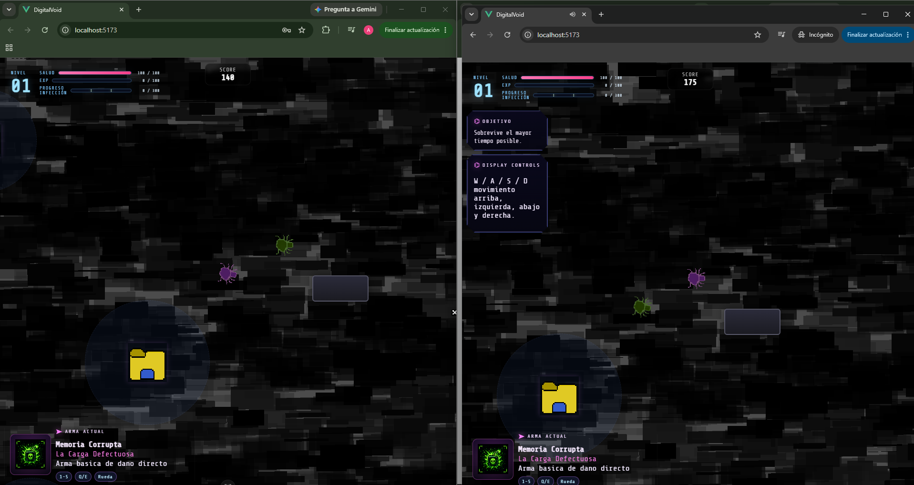

# Digital Void

Digital Void es un juego web desarrollado con Vue 3 y Vite, y usa Pinia para el manejo de estado.

## Tecnologías principales

- **Frontend:** Vue 3
- **Estado:** Pinia
- **Bundler/Dev Server:** Vite
- **Gestor de paquetes:** pnpm (lockfile: `pnpm-lock.yaml`)

## Requisitos

- Node.js 20.x+ (se recomienda 20.19.0)

## Ejecutar la aplicación localmente

1. Clona el repositorio:

```bash
git clone https://github.com/Newt90xz/Digitalvoid
```

2. Ejecuta el backend localmente

```bash
cd backend
pnpm install
docker compose up -d 
pnpm run seed
pnpm run start
```


3. Ejecutar frontend en modo desarrollo:

```bash
pnpm install
pnpm run dev
```

4. Abre `http://localhost:5173`

## Construir para producción

5. Ejecutar frontend en modo producción optimizada:

```bash
pnpm build
pnpm run preview
```
`pnpm run preview` sirve el contenido de `dist` localmente para pruebas.

6. Abre `http://localhost:4173`


## Ejecutar con Docker

Para ejecutar los contenedores del backend, frontend y la base de datos de mongo locales, ejecuta el siguiente comando en tu terminal:

```bash
docker compose up --build
```
Esto se encargara de levantar los contenedores y levantar los servicios. Al terminar, esta estara corriendo en `localhost://10081`.

### Ejecutar con DockerHub

Si prefieres usar las imágenes ya publicadas en DockerHub en lugar de construirlas, primero debes descargar el archivo docker-compose.yml del repositorio público a tu carpeta local.
Esto es necesario porque este archivo ya contiene las direcciones correctas de las imágenes del juego para que se descarguen automáticamente. 
Ejecuta lo siguiente:

```bash
curl -O https://raw.githubusercontent.com/Newt90xz/Digitalvoid/main/docker-compose.yml
```

Luego simplemente ejecuta:

```bash
docker compose pull
docker compose up
```

Esto descargara las imagenes y luego las ejecutara en el docker, y se levantaran en `localhost://10081`.

Esto descargara y ejecutara los contenedores dentro de Dockerhub.

Las direcciones de estos son:

- Backend: https://hub.docker.com/r/zeeloved/digitalvoid-backend
- Frontend: https://hub.docker.com/r/zeeloved/digitalvoid-web


## Cooperativo
Para probar el cooperativo localmente, debe abrir el frontend en dos pestañas de incognito, iniciar sesion con dos cuentas diferentes, y entrar a multijugador.  
En una de las cuentas, iniciar "Nueva Inyeccion" y luego en la otra "Inyeccion en proceso", ahi saldra una sala abierta donde estara jugando la primera cuenta, uno simplemente lo presiona y juega en tiempo real.

Imagen de prueba:  
